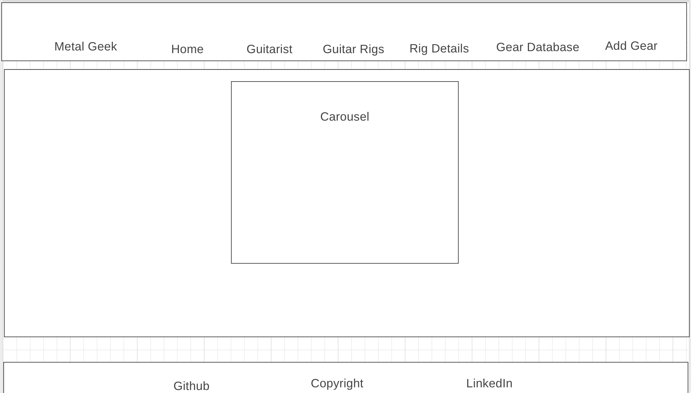

# Welcome to Metal Geek

## A Project by Greg Swan

This website was designed to allow all new and seasoned guitarists to learn about the actual guitar rigs that their favorite guitarists are or were using. 

This, of course, includes a listing of all of their gear from guitars and pickups, to effect pedals and amplifiers. 

We even go into detail about the configuration setup that is involved as well as any special guitar string tuning.

We realize that for musicians, it is all about getting that tone and matching that sound. There are so many factors involved, not counting the individual's technique, but matching up to the guitar rig is a great start.

Our plan is to provide simple navigation from our list of top lead guitar players, to their guitar rig model, and on to the rig details model which will go into more detail for each artist rig details setup.

This project is a full stack application, meaning we will have a front end (React) visible website and it will use a backend database (Django) to supply data for the front end website.

Our backend is on a separate repository, you can find the link here: (https://github.com/swanmac/metal-geek-back-end)

We started with three models, however we added one additional model "Gear" to handle the gear database.

The information for the database is being extracted and recreated from a now defuncted website through the use of an online tool that permits viewing of previous versions of websites.

### Models

- Artist
- Artist Rig
- Rig Details
- Gear (Full CRUD)

### Technology Used

- React
- Python
- Django

### Additional Technology Used

- React Spring

### Technology Not Used in Class

- React-carousel-card-3d
- Flowbite Tailwind

### Challenges

- Adding Full CRUD to the front and backend

### Stretch Goals

Stretch goals for this project were accomplished by adding the musical instrument database model that is Full CRUD on the backend in Django and on the frontend in React.

### Project Links

- Components
(https://www.figma.com/file/NN2vGWj9GZLD0FjBzsYFWz/Components?node-id=0%3A1&t=eipI4lA5GTQkPDd2-0)

- ERD
(https://www.figma.com/file/30MeMJhZlMiJsdrghEy6q5/ERD?node-id=0%3A1&t=U33VZoPjI7scWDMT-0)

- Trello Board
(https://trello.com/b/KPZIYybi/project-4)

- WireFrame
- Home (https://wireframe.cc/zBtO8h)
- Artist (https://wireframe.cc/dCIuGo)
- Artist Rig https://wireframe.cc/v4uOcy)
- Rig Details (https://wireframe.cc/5OLgcc)
- Gear Database (https://wireframe.cc/GcHyvh)
- Gear CRUD (https://wireframe.cc/D3GTeo)

## Website

## Home

## Artist

## Artist Rig

## Rig Details

## Gear Database

## Gear CRUD
