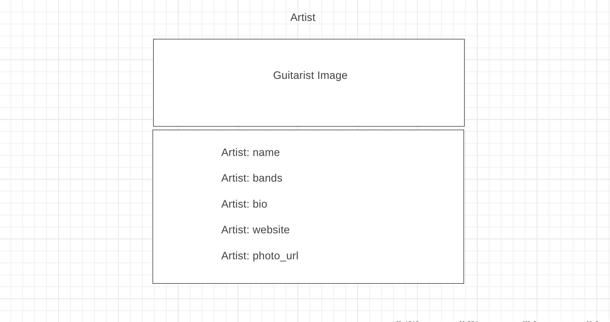

# Welcome to Metal Geek

## A Project by Greg Swan

This website was designed to allow all new and seasoned guitarists learn about the actual guitar rigs that their favorite guitarists are using. 

This, of course, includes a listing of all of their gear from guitars and pickups, to effect pedals and amplifiers. 

We even go into detail about the configuration setup that is involved as well as any special tuning.

We realize that is all about getting that tone and matching that sound. There are so many factors involved, not counting the individual technique, but matching up to the guitar rig is a great start.

Our plan is to provide simple navigation from our list of top lead guitar players, to their guitar rig model, and on to the rig details model which will go into more detail for each artist.

This project is a full stack application, meaning we will have a front end (React) visible website and it will use a backend database (Django) to supply data for the front end website.

We may include the backend on this repository, but we have not decided at this stage of development.

### Technology Used

- React
- Python
- Django

### Additional Technology Used

- React Spring
- React-carousel-card-3d

### Stretch Goals

Stretch goals for this project may be React Native to create a mobile responsive website. Another stretch goal might be to add a musical instrument database tied into the Artist Rig model.

### Project Links

- Components
(https://www.figma.com/file/NN2vGWj9GZLD0FjBzsYFWz/Components?node-id=0%3A1&t=eipI4lA5GTQkPDd2-0)

- ERD
(https://www.figma.com/file/30MeMJhZlMiJsdrghEy6q5/ERD?node-id=0%3A1&t=U33VZoPjI7scWDMT-0)

- Trello Board
(https://trello.com/b/KPZIYybi/project-4)

- WireFrame
- Home (https://wireframe.cc/zBtO8h)
- Artist (https://wireframe.cc/dCIuGo)
- Artist Rig https://wireframe.cc/v4uOcy)
- Rig Details (https://wireframe.cc/5OLgcc)

## Home

## Artist

## Artist Rig

## Rig Details
